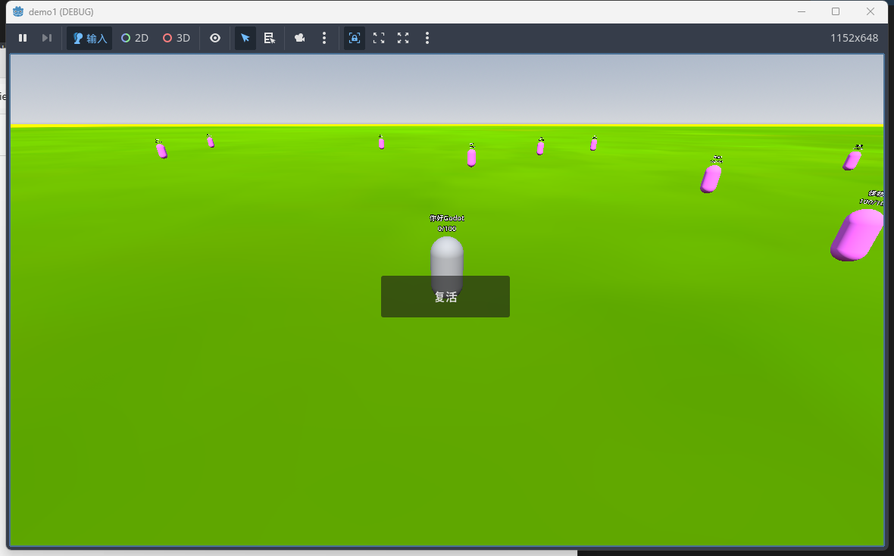
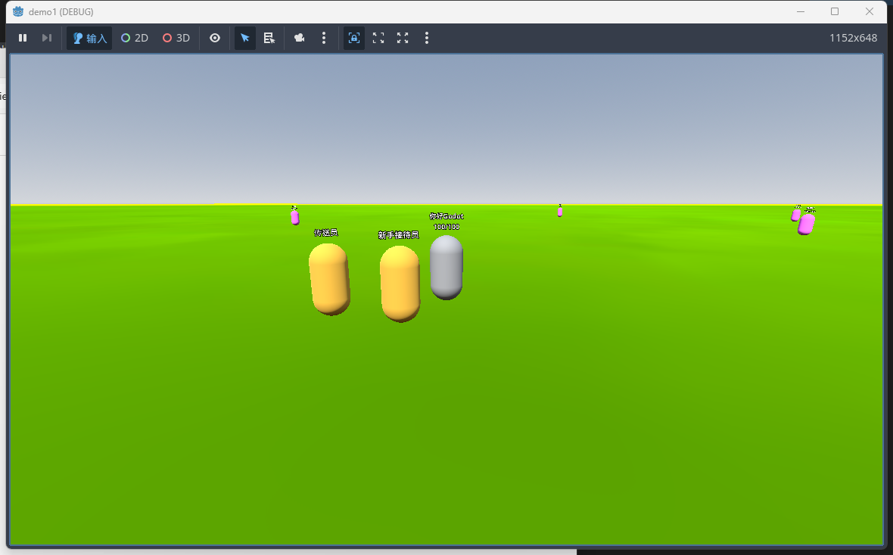

# Godot Demo

版本：Godot Engine v4.4.1.stable.mono

引擎版本：[dev-2.6.x](https://github.com/KBEngineLab/KBEngine-Nex/tree/dev-2.6.x)

服务端：https://github.com/KBEngineLab/demo_kbengine_nex_assets

# 功能：

- [x] 登录
- [x] 注册
- [x] 创建角色
- [x] 删除角色
- [x] 进入世界
- [x] 怪物创建
- [x] 玩家创建
- [x] NPC创建
- [x] 传送门创建
- [ ] 死亡/复活 无
- [ ] 攻击/攻击动画 无

# sdk 生成

start "" "%KBE_BIN_PATH%/kbcmd.exe" --clientsdk=csharp --outpath="%~dp0/kbengine_csharp_plugins"

将kbengine_csharp_plugins 覆盖 /kbengine_csharp_plugins

# 截图：

